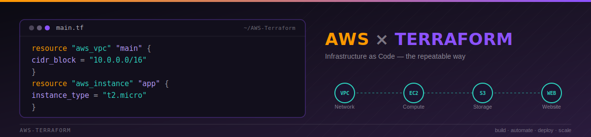
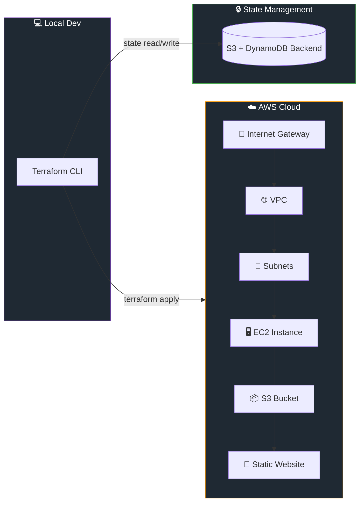

<div align="center">



<br/><br/>

[](https://www.terraform.io/)
[](https://aws.amazon.com/)
[](https://github.com/)

[](../../stargazers)
[](../../network/members)
[](../../commits)
[](#)

</div>

---

## 🧭 Table of Contents

- [Overview](#-overview)
- [Key Learning Areas](#-key-learning-areas)
- [Architecture at a Glance](#-architecture-at-a-glance)
- [Repository Structure](#-repository-structure)
- [Projects Included](#%EF%B8%8F-projects-included)
- [Getting Started](#-getting-started)
- [Technology Stack](#-technology-stack)
- [Skills Demonstrated](#-skills-demonstrated)
- [Roadmap](#-roadmap)
- [Author](#-author)
- [Support](#-show-your-support)

---

## 📖 Overview

This repository is a hands-on collection of **AWS Infrastructure as Code (IaC)** projects built with **Terraform**.

Every folder here is a self-contained example focused on automating cloud infrastructure deployment, improving consistency across environments, and demonstrating practical AWS + DevOps skills through real, runnable code — not just theory.

> 💡 **Goal:** turn manual, click-ops AWS setup into version-controlled, repeatable, reviewable infrastructure.

---

## 🎯 Key Learning Areas

<div align="center">

| 🏗️ Provisioning | 🌐 Networking | 🔁 Automation | 📦 State |
|:---:|:---:|:---:|:---:|
| Infrastructure as Code | Cloud Networking | DevOps Best Practices | Terraform State Management |
| Resource Provisioning | VPC / Subnets / Routing | CI/CD-ready workflows | Remote Backends |
| AWS Cloud Services | Internet Gateways | Git & GitHub Version Control | Drift Detection |

</div>

---

## 🗺️ Architecture at a Glance

A simplified view of how the pieces in this repo relate to one another:



---

## 📂 Repository Structure

```text
AWS-Terraform
│
├── aws-ec2/
│   ├── main.tf
│   ├── variables.tf
│   └── outputs.tf
│
├── aws-s3/
│   ├── main.tf
│   └── myfile.txt
│
├── aws-vpc/
│   └── main.tf
│
├── project-static-website/
│   ├── main.tf
│   ├── index.html
│   └── styles.css
│
├── tf-backend/
│   └── main.tf
│
└── tf-commands.txt
```

---

## 🛠️ Projects Included

<details open>
<summary><b>🖥️ EC2 Infrastructure</b></summary>
<br>

Provision Amazon EC2 instances using Terraform with reusable variables and outputs.

**Services Used:** `Amazon EC2` · `Terraform Variables` · `Terraform Outputs`

</details>

<details>
<summary><b>📦 S3 Bucket Management</b></summary>
<br>

Create and manage Amazon S3 buckets through Infrastructure as Code.

**Services Used:** `Amazon S3` · `Terraform AWS Provider`

</details>

<details>
<summary><b>🌐 VPC Infrastructure</b></summary>
<br>

Deploy custom AWS networking components from scratch.

**Services Used:** `Amazon VPC` · `Subnets` · `Route Tables` · `Internet Gateway`

</details>

<details>
<summary><b>🎨 Static Website Hosting</b></summary>
<br>

Host a static website using AWS infrastructure fully managed by Terraform.

**Features:** Automated deployment · Infrastructure provisioning · Website asset management

</details>

<details>
<summary><b>🔒 Terraform Backend Configuration</b></summary>
<br>

Configure Terraform state management for reliable, team-safe infrastructure deployments.

**Features:** State Management · Backend Configuration · Infrastructure Consistency

</details>

---

## 🚀 Getting Started

**1. Clone the repository**
```bash
git clone https://github.com/<your-username>/AWS-Terraform.git
cd AWS-Terraform
```

**2. Configure AWS credentials**
```bash
aws configure
```

**3. Initialize Terraform**
```bash
terraform init
```

**4. Validate the configuration**
```bash
terraform validate
```

**5. Review the execution plan**
```bash
terraform plan
```

**6. Deploy the infrastructure**
```bash
terraform apply
```

**7. Tear it down when you're done**
```bash
terraform destroy
```

---

## 🧰 Technology Stack

<div align="center">


</div>

---

## 📈 Skills Demonstrated

- ☁️ AWS Cloud Infrastructure
- ⚙️ Terraform Configuration Management
- 🔁 Infrastructure Automation
- 🌐 Networking Fundamentals
- 🔄 Resource Lifecycle Management
- 🧩 DevOps Practices
- 🗂️ Git Version Control

---

## 🔮 Roadmap

- [ ] Terraform Modules
- [ ] Remote State Backend (S3 + DynamoDB)
- [ ] CI/CD Pipelines
- [ ] Auto Scaling Groups
- [ ] Load Balancers
- [ ] Monitoring & Logging
- [ ] Multi-Environment Deployments (dev / staging / prod)

---

## 👨‍💻 Author

<div align="center">

**AWS & DevOps Enthusiast**

Focused on Cloud Computing, Infrastructure Automation, Terraform, AWS, and Modern DevOps Practices.

[](https://github.com/your-username)
[](https://linkedin.com/in/your-username)

</div>

---

## ⭐ Show Your Support

If this repository helped you learn Terraform or AWS, consider giving it a star — it genuinely helps!

<div align="center">

[](https://star-history.com/#your-username/AWS-Terraform&Date)

</div>

<div align="center">

Made with ☁️ + 🛠️ + ❤️

</div>
